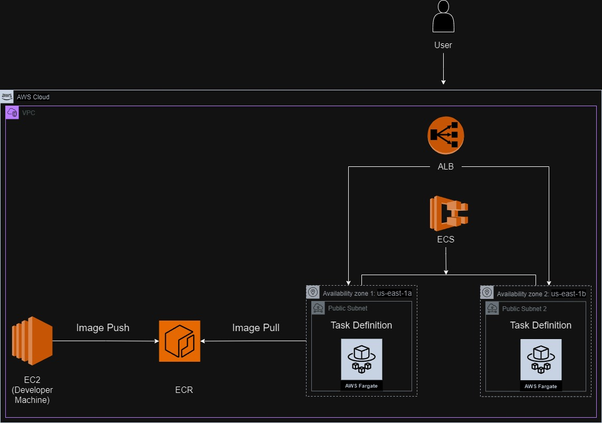

# Quest Application Deployment on AWS using Terraform

This project demonstrates the deployment of the Quest application on AWS using Terraform to manage various AWS services including EC2, ECR, ECS, and ALB. The architecture is designed to ensure high availability, scalability, and efficient deployment of Docker containers.

## Architecture Overview

The architecture consists of the following components:
- **VPC (Virtual Private Cloud)**: Provides an isolated network environment for your resources. Includes two public subnets for high availability.
- **EC2 Instance**: Used as a developer machine to build and push Docker images to ECR.
- **ECR (Elastic Container Registry)**: Stores Docker images.
- **ECS (Elastic Container Service)**: Manages the deployment of Docker containers using Fargate.
- **Fargate**: A serverless compute engine for containers that works with ECS to run containers without managing servers.
- **ALB (Application Load Balancer)**: Distributes incoming traffic to the ECS tasks running in multiple availability zones.



## Detailed Flow

1. **Creating the VPC**:
    - A VPC is created along with two public subnets to ensure high availability.
    - The VPC configuration includes necessary route tables and internet gateways to allow external access.

2. **Development Environment**:
    - A developer works on the Quest application on a local machine.
    - Once changes are made, the developer connects to the EC2 instance running in the VPC using SSH.

3. **Building the Docker Image**:
    - On the EC2 instance, the developer clones the Quest application repository.
    - A Dockerfile is created and used to build the Docker image.
    - The Docker image is tagged and pushed to the ECR repository.

4. **ECR (Elastic Container Registry)**:
    - The ECR stores the Docker images, making them available for deployment.

5. **ECS (Elastic Container Service) and Fargate**:
    - ECS is configured to use Fargate for serverless container management.
    - ECS pulls the Docker image from ECR and deploys it as tasks in Fargate.
    - The tasks are distributed across multiple availability zones for high availability.

6. **ALB (Application Load Balancer)**:
    - The ALB is configured with target groups pointing to the ECS tasks.
    - It distributes incoming user requests to the ECS tasks, ensuring load balancing and fault tolerance.

7. **User Requests**:
    - Users access the Quest application via a DNS name associated with the ALB.
    - The ALB routes the requests to the appropriate ECS tasks running in different availability zones.

## Prerequisites

Before you begin, ensure you have the following:
- AWS account with appropriate permissions
- AWS CLI installed and configured
- Terraform installed
- Git installed

## Setup Instructions

### 1. Clone the Repository

```bash
git clone https://github.com/your-username/your-repo-name.git
cd your-repo-name
